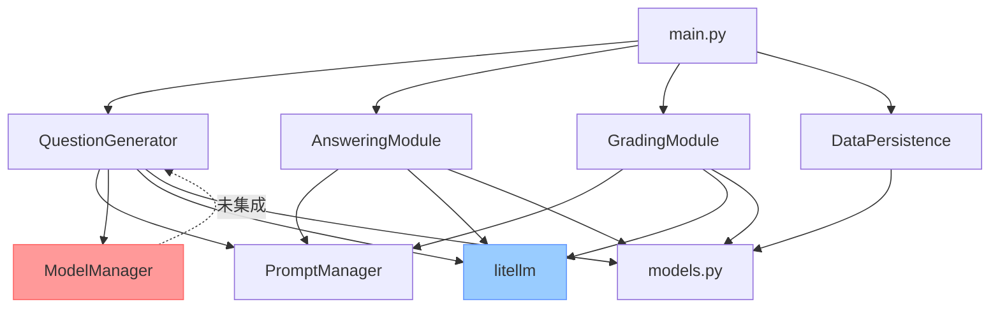

# 项目架构深度分析报告

**分析日期**: 2025-10-14  
**项目**: IgnisBenchmark - QA生成系统  
**当前版本**: Milestone 1 完成

---

## 📋 执行摘要

### 当前状态
✅ **已完成**: Milestone 1 (单文献20题生成)  
🔄 **进行中**: 向Milestone 2 (100文献批量生成) 演进  
⚠️ **问题**: 架构存在耦合、并发混乱、扩展性不足

### 核心问题识别

| 问题域 | 严重程度 | 影响范围 |
|--------|----------|----------|
| **模块耦合度高** | 🔴 高 | 维护困难、测试困难 |
| **并发控制混乱** | 🔴 高 | 性能瓶颈、资源浪费 |
| **配置不一致** | 🟡 中 | 代码可读性差、易出错 |
| **错误处理分散** | 🟡 中 | 调试困难、日志混乱 |
| **可测试性差** | 🟡 中 | 单元测试缺失、集成测试困难 |

---

## 🏗️ 当前架构分析

### 1. 组件清单

```
distillation_generation/
├── src/
│   ├── question_generator.py      # 题目生成 [250行]
│   ├── answering_module.py        # 模型解题 [236行]
│   ├── grading_module.py          # 自动判题 [210行]
│   ├── model_manager.py           # 模型回退 [375行] ⚠️未使用
│   ├── data_persistence.py        # 数据持久化 [211行]
│   ├── prompt_manager.py          # Prompt管理
│   ├── models.py                  # 数据模型 [148行]
│   ├── token_tracker.py           # Token统计
│   └── utils.py                   # 工具函数
├── main.py                        # 主流程 [221行]
└── milestone1_generator.py        # M1脚本 [450行]
```

### 2. 依赖关系图



### 3. 关键问题剖析

#### 问题1: 模型调用逻辑重复 🔴

**现状**:
- `QuestionGenerator`: 内嵌模型回退逻辑 (120行代码)
- `AnsweringModule`: 内嵌重试逻辑 (80行代码)
- `GradingModule`: 内嵌重试逻辑 (70行代码)
- `ModelManager`: 完整实现但**未被使用**

**代码示例** (question_generator.py L104-180):
```python
# 每个模块都重复实现了模型回退
model_fallbacks = []
if config and 'generation_models' in config:
    for m in config['generation_models']:
        # ... 50行配置解析代码
for attempt in range(3):
    for model_index, m in enumerate(model_fallbacks):
        try:
            response = completion(...)
            # ... 重试逻辑
```

**问题**:
- 代码重复率 > 60%
- 逻辑不一致 (各模块重试次数不同)
- 难以统一调优

#### 问题2: 并发配置混乱 🔴

**config.yaml 的矛盾**:
```yaml
rounds_concurrency: 3           # 轮次间并发
round_internal_concurrency: 5   # 轮次内并发
max_concurrent_requests: 10     # 最大请求数

# 注释写道：
# 这里有问题！！！！！题目生成、解答和判题的并发数应当是独立的！
```

**实际执行**:
- `QuestionGenerator`: **串行**生成 (1个模型调用/batch)
- `AnsweringModule`: 使用`ThreadPoolExecutor(max_workers=5)` 并发解题
- `GradingModule`: **串行**判题
- `main.py`: **串行**调用三个模块

**问题**:
- 配置项与实际行为不匹配
- 并发层次不清晰 (轮次级 vs 题目级 vs 请求级)
- 资源利用率低

#### 问题3: 配置初始化不一致 🟡

**三种初始化模式**:

1. **配置字典模式** (新)
```python
generator = QuestionGenerator(config_dict)
```

2. **参数模式** (旧)
```python
generator = QuestionGenerator("gemini/...", batch_size=10)
```

3. **混合模式** (兼容层)
```python
def __init__(self, config_or_model_name, batch_size=None, ...):
    if isinstance(config_or_model_name, dict):
        # 配置字典
    else:
        # 单独参数
```

**问题**:
- 代码冗长 (每个模块50行初始化代码)
- 类型不安全
- IDE无法自动补全

#### 问题4: 数据流混乱 🟡

**当前数据流**:
```
main.py:
  1. 从benchmark_bank抽取Few-shot
  2. 生成题目 → List[QuestionUnit]
  3. 解题 → 修改QuestionUnit.candidate_answer
  4. 判题 → 返回GradingResult
  5. 根据结果分流:
     - 错题 → save_to_benchmark()
     - 正确 → save_to_validation()
```

**问题**:
- 状态可变 (QuestionUnit被多次修改)
- 中间状态无追踪
- 无法恢复/重试单个步骤

#### 问题5: 错误处理碎片化 🟡

**各模块独立处理错误**:
```python
# question_generator.py
try:
    response = completion(...)
except Exception as e:
    logger.warning(f"模型失败: {e}")
    continue  # 静默重试

# answering_module.py
except Exception as e:
    logger.error(f"解题失败: {e}")
    return "[ERROR] ..."  # 返回错误字符串

# grading_module.py
except Exception as e:
    if error_callback:
        error_callback(question, ...)  # 回调函数
```

**问题**:
- 错误处理方式不统一
- 难以追踪失败原因
- 重试策略不一致

---

## 📊 性能瓶颈分析

### Milestone 1 实测数据

| 阶段 | 耗时 | 瓶颈 |
|------|------|------|
| **论文加载** | <1s | ✅ 无 |
| **题目生成** | ~60s | 🔴 **单次LLM调用** (20题一次性生成) |
| **元数据包装** | <1s | ✅ 无 |
| **保存文件** | <1s | ✅ 无 |
| **生成报告** | <1s | ✅ 无 |
| **总计** | ~16分钟 | 🔴 **模型回退重试** (Gemini失败2次) |

### Milestone 2 预测 (100篇论文)

**假设**:
- 每篇论文生成20题
- 平均成功率: 70% (第一次成功)
- 平均生成时间: 60s/篇

**串行执行**:
```
总时间 = 100篇 × 60s = 6000s ≈ 100分钟
```

**并行执行 (3并发)**:
```
总时间 = 100篇 / 3 × 60s ≈ 33分钟
```

**瓶颈**:
1. LLM API速率限制
2. Token配额消耗
3. 网络超时重试

---

## 🎯 架构改进目标

### 1. 模块化原则

```
Single Responsibility Principle (SRP)
├─ ModelClient:        只负责调用LLM API
├─ RetryManager:       只负责重试逻辑
├─ ConcurrencyManager: 只负责并发控制
├─ QuestionGenerator:  只负责构建Prompt
└─ DataRepository:     只负责数据存储
```

### 2. 可插拔设计

```python
# 策略模式
class GenerationStrategy(Protocol):
    def generate(self, paper: Paper) -> List[Question]:
        ...

class SinglePaperStrategy(GenerationStrategy): ...
class BatchPaperStrategy(GenerationStrategy): ...

# 依赖注入
pipeline = Pipeline(
    generator=GenerationStrategy,
    answerer=AnsweringStrategy,
    grader=GradingStrategy,
    storage=StorageBackend
)
```

### 3. 并发分层

```
Level 1: 论文级并发 (批次处理)
    ├─ 3-5篇论文同时处理
    │
    ├─ Level 2: 题目级并发 (单批次内)
    │   ├─ 生成: 1个LLM调用 → 20题
    │   ├─ 解题: 20题 × 5并发
    │   └─ 判题: 20题 × 3并发
    │
    └─ Level 3: 请求级并发 (底层API)
        └─ 共享信号量控制总请求数
```

### 4. 配置驱动

```yaml
# 清晰的配置层次
generation:
  strategy: "batch"
  concurrency: 3
  models:
    - name: "gemini-2.5-flash"
      priority: 1
      retry: 2

answering:
  concurrency: 5
  models: [...]

grading:
  concurrency: 3
  models: [...]
```

### 5. 可观测性

```python
# 统一监控
from observability import MetricsCollector

metrics = MetricsCollector()
with metrics.track("question_generation"):
    questions = generator.generate(...)
    
# 输出:
# - 成功率
# - 平均延迟
# - Token消耗
# - 模型切换次数
```

---

## 🚀 下一步行动

### 优先级 P0 (必须立即解决)
1. ✅ **创建架构分析文档** (本文档)
2. 📝 **设计新架构方案** → `02_NEW_ARCHITECTURE_DESIGN.md`
3. 📝 **制定迁移计划** → `03_MIGRATION_ROADMAP.md`

### 优先级 P1 (Milestone 2前完成)
4. 🔧 **实现统一ModelClient**
5. 🔧 **实现ConcurrencyManager**
6. 🔧 **重构三大模块**

### 优先级 P2 (可延后)
7. 🧪 **补充单元测试**
8. 📊 **添加性能监控**
9. 📚 **完善文档**

---

## 📌 建议

### 对于当前状态
- ✅ **Milestone 1代码可以保持不动** - 作为功能验证参考
- ⚠️ **不要在现有main.py上继续开发** - 技术债会爆炸
- 🎯 **使用Milestone 1的成果** - 复用Prompt、数据模型

### 对于Milestone 2
- 🏗️ **从零重构主流程** - 基于新架构
- 🔌 **保持接口兼容** - 复用现有模块作为适配器
- 📦 **渐进式迁移** - 先重构调用层，再重构实现

### 对于长期
- 🎓 **投资可测试性** - 编写单元测试
- 📊 **投资可观测性** - 添加详细日志
- 🔐 **投资鲁棒性** - 完善错误处理

---

## 🔗 相关文档

- [新架构设计](./02_NEW_ARCHITECTURE_DESIGN.md) - 详细设计方案
- [迁移路线图](./03_MIGRATION_ROADMAP.md) - 分步实施计划
- [API设计文档](./04_API_DESIGN.md) - 接口定义
- [并发控制方案](./05_CONCURRENCY_DESIGN.md) - 并发架构

---

**审阅者**: AI架构师  
**状态**: 待审核 → 下一步: 设计新架构
